# ProMethylNet
ProMethylNet is a deep learning model that integrates multimodal features, combining MSCANet, GAT, BiLSTM and an attention mechanism, for accurate prediction of protein methylation sites.
# Model
## Model Architecture

## Multi-Scale Convolution-Attention Network Architecture

## Graph Neural Network Architecture

## BiLSTM Architecture

# Evaluation Metrics(on an independent test set)
## Performance results of ablation experiments
| Experiment | Accuracy (%) | Recall (%) | Precision (%) | F1 (%) | AUC (%) | MCC (%) |
|------------|------------|------------|------------|------------|------------|------------|
| **Baseline** | 99.752 | 90.361 | 92.480 | 91.408 | 99.359 | 91.289 |
| **No MSCANet** | 99.396 | 76.633 | 80.917 | 78.717 | 99.322 | 78.441 |
| **No GAT** | 99.692 | 91.600 | 87.815 | 89.668 | 99.315 | 89.532 |
| **No Attention** | 99.726 | 86.187 | 94.546 | 90.173 | 99.518 | 90.134 |
| **No BiLSTM** | 83.142 | 96.810 | 7.744 | 14.342 | 98.223 | 24.760 |
| **No MSCANet + No Attention** | 99.364 | 72.747 | 81.626 | 76.931 | 99.217 | 76.741 |
| **No MSCANet + No GAT** | 99.740 | 26.947 | 4.386 | 7.544 | 66.320 | 7.663 |
| **No MSCANet + No GAT + ProtBERT_PSSM** | 99.740 | 90.989 | 91.159 | 91.074 | 99.523 | 90.942 |
| **No Attention + No BiLSTM + OneHot** | 98.689 | 53.080 | 55.245 | 54.141 | 97.681 | 53.487 |
| **Features_OneHot_Properties** | 98.805 | 63.771 | 58.236 | 60.878 | 98.373 | 60.337 |
| **Features_ProtBERT_PSSM** | 99.818 | 91.193 | 96.153 | 93.607 | 98.916 | 93.549 |
## **Observations**
- **Baseline achieves the highest F1 score (91.408%)**, maintaining a good balance between Precision and Recall.
- **Removing BiLSTM drastically reduces F1-score (14.342%)**, indicating its critical role in long-sequence modeling.
- **No MSCANet + No GAT significantly drops AUC (66.320%)**, showing the importance of feature extraction and graph modeling.
- **ProtBERT_PSSM enhances classification performance (F1: 93.607%)**, demonstrating the benefits of deep feature representation.

## Evaluation result for baseline_all_features_all_modules

    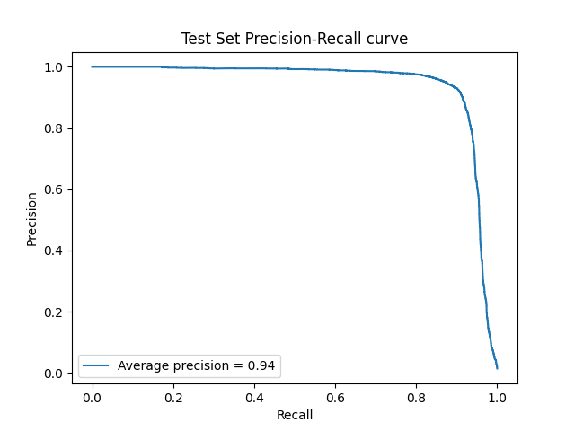
    
    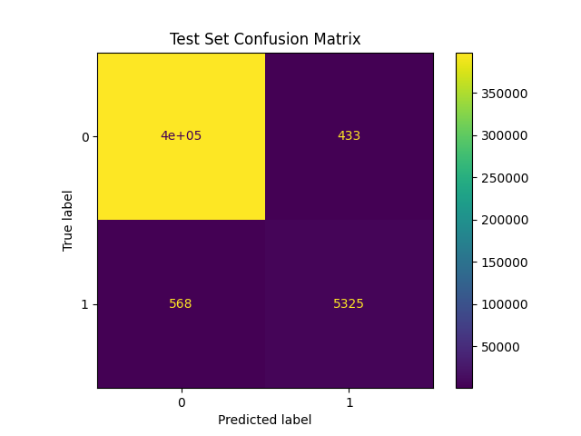

## Evaluation result for features_onehot_properties

    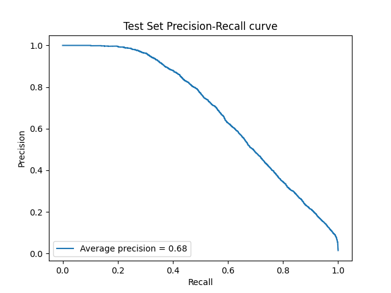
    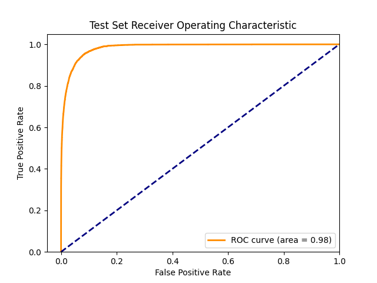
    

## Evaluation result for features_protbert_pssm

    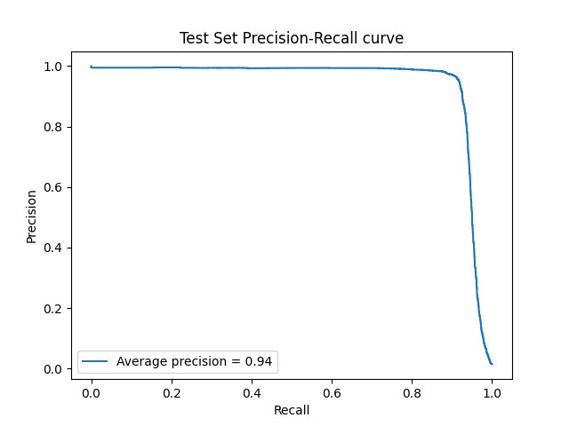
    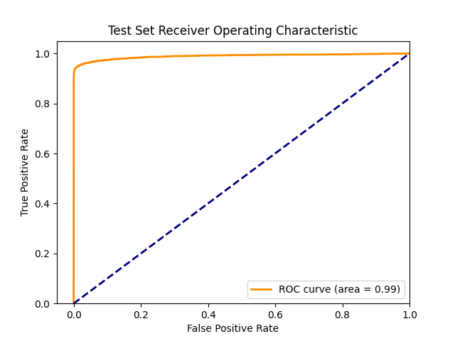
    

## Evaluation result for no_MSCANet

    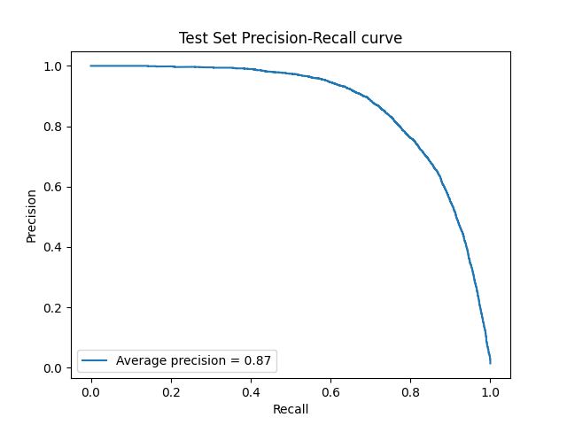
    
    

## Evaluation result for no_MSCANet_no_attention

    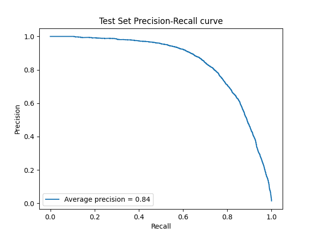
    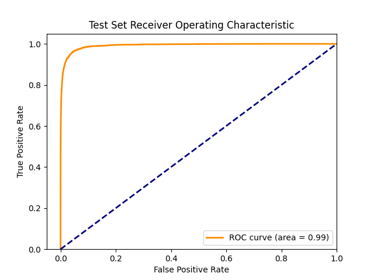
    

## Evaluation result for no_MSCANet_no_gat

    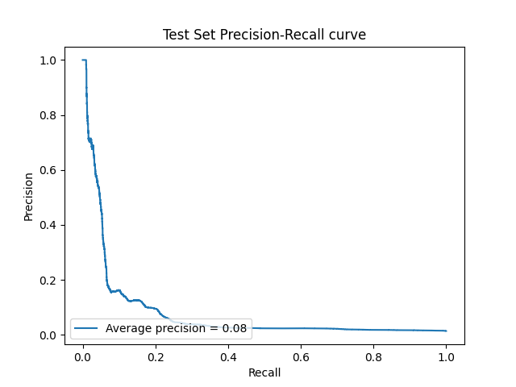
    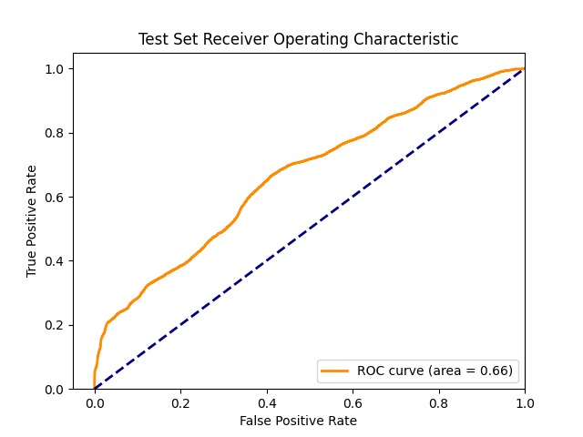
    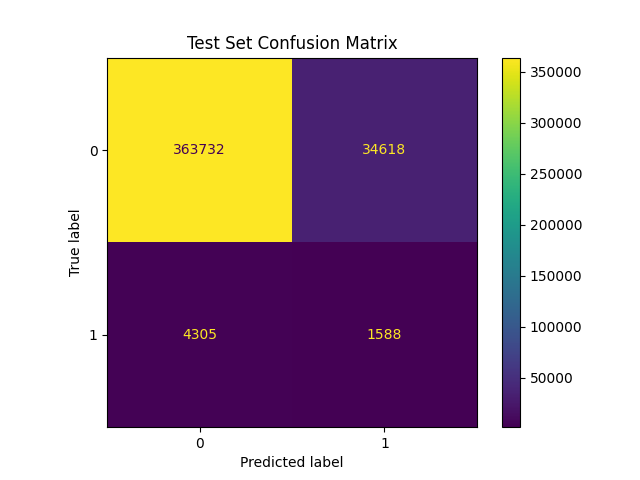

## Evaluation result for no_MSCANet_no_gat_features_protbert_pssm

    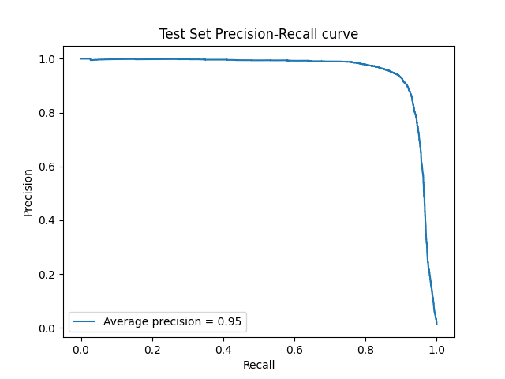
    
    

## Evaluation result for no_attention

    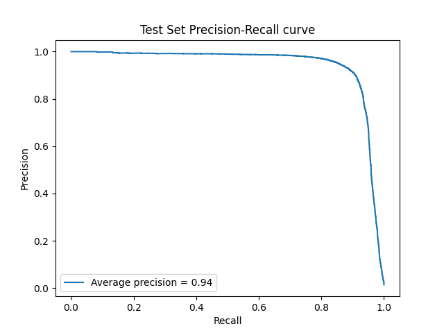
    
    

## Evaluation result for no_attention_no_lstm_features_onehot_properties

    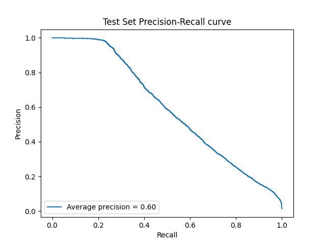
    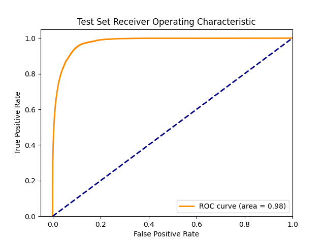
    

## Evaluation result for no_bilstm

    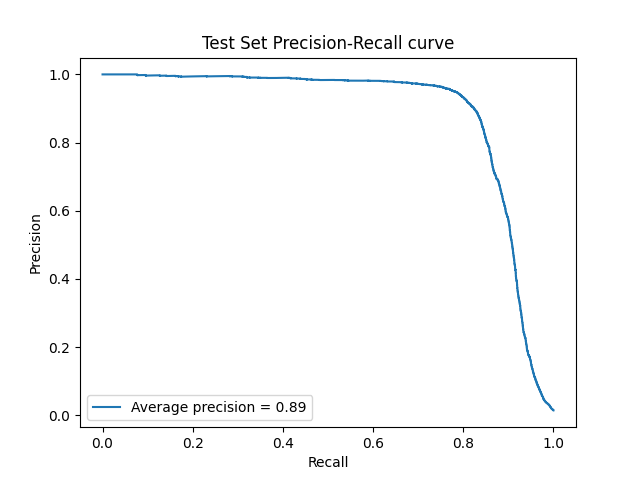
    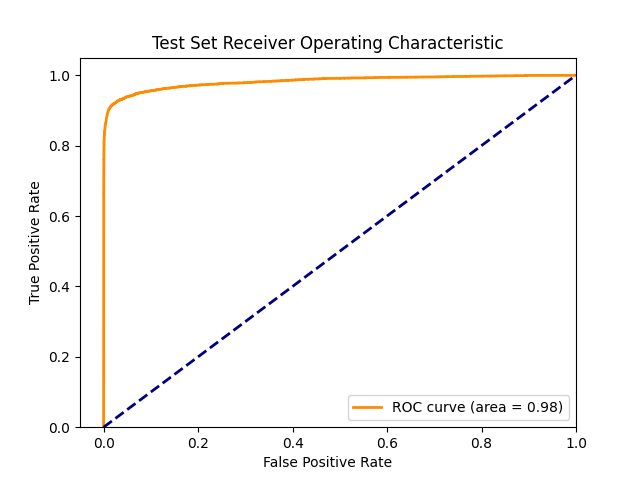
    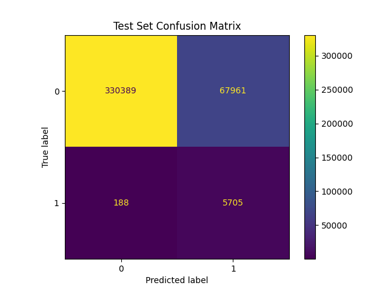

## Evaluation result for no_gat

    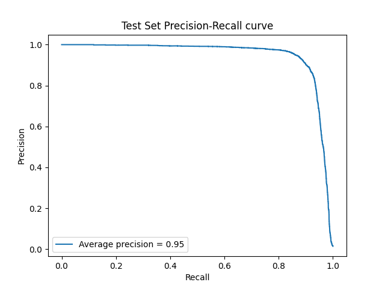
    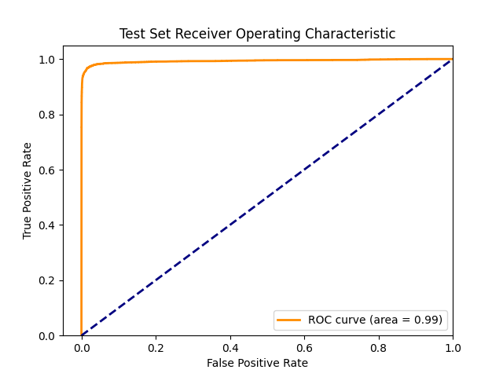
    

## Performance Drop From Baseline
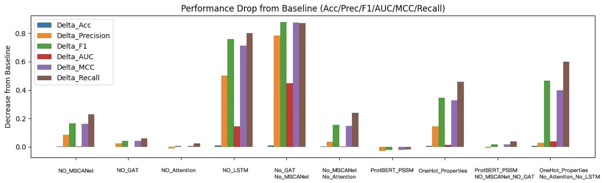

# Performance Degradation & t-Test Results
## Experiment Comparison
| Experiment | F1 Reduction | p-value | AUC Reduction | p-value | MCC Reduction | p-value | Precision Reduction | p-value | Recall Reduction | p-value | Accuracy Reduction | p-value |
|------------|------------|------------|------------|------------|------------|------------|------------|------------|------------|------------|------------|------------|
| **no_MSCANet** | 0.1662 | 2.5721e-06 | 0.0027 | 2.6466e-03 | 0.1636 | 7.7692e-07 | 0.0861 | 3.2045e-03 | 0.2284 | 1.5632e-04 | 0.0039 | 4.2393e-06 |
| **no_GAT** | 0.0435 | 2.3891e-01 | -0.0004 | 6.9305e-01 | 0.0438 | 2.4180e-01 | 0.0247 | 4.7999e-01 | 0.0611 | 1.3967e-01 | 0.0011 | 2.6866e-01 |
| **no_Attention** | 0.0077 | 7.1493e-02 | -0.0007 | 5.0926e-01 | 0.0074 | 8.9086e-02 | -0.0112 | 3.2827e-01 | 0.0252 | 7.4310e-03 | 0.0001 | 2.5049e-01 |
| **no_BiLSTM** | 0.7565 | 5.4568e-04 | 0.1450 | 7.4424e-02 | 0.7119 | 2.0317e-03 | 0.5021 | 9.8665e-02 | 0.7989 | 5.1118e-05 | 0.0097 | 6.8347e-05 |
| **no_MSCANet_no_GAT** | 0.8774 | 9.1780e-09 | 0.4474 | 1.3736e-03 | 0.8737 | 1.8861e-08 | 0.7836 | 1.2532e-03 | 0.8717 | 5.7597e-08 | 0.0107 | 1.7090e-06 |
| **no_MSCANet_no_Attention** | 0.1534 | 2.0511e-05 | 0.0039 | 2.4728e-03 | 0.1469 | 2.0260e-05 | 0.0342 | 8.0569e-03 | 0.2405 | 7.8599e-06 | 0.0034 | 3.2917e-05 |
| **features_ProtBERT_PSSM** | -0.0228 | 2.0606e-04 | 0.0014 | 4.1379e-01 | -0.0231 | 2.1022e-04 | -0.0287 | 1.5606e-02 | -0.0169 | 7.5547e-02 | -0.0007 | 4.6349e-04 |
| **features_OneHot_Properties** | 0.3468 | 3.1477e-05 | 0.0152 | 1.1027e-03 | 0.3269 | 2.4352e-05 | 0.1439 | 1.1642e-03 | 0.4568 | 2.9190e-05 | 0.0069 | 2.8820e-05 |
| **no_MSCANet_no_GAT_features_ProtBERT_PSSM** | 0.0168 | 3.4866e-02 | 0.0001 | 8.7641e-01 | 0.0165 | 3.7371e-02 | -0.0072 | 2.1836e-01 | 0.0390 | 4.0711e-03 | 0.0004 | 6.6479e-02 |
| **no_Attention_no_LSTM_features_OneHot_Properties** | 0.4671 | 2.8015e-05 | 0.0401 | 2.0737e-02 | 0.3989 | 2.7932e-05 | 0.0287 | 1.0294e-01 | 0.6010 | 8.8345e-06 | 0.0075 | 2.7308e-05 |

## **Summary**
- The **no_BiLSTM** and **no_MSCANet_no_GAT** experiments show the most significant performance drop.
- **features_ProtBERT_PSSM** slightly improves performance (`F1: -0.0228`), indicating its effectiveness.
- The **t-test p-values** highlight statistically significant performance degradation for key experiments.

# Requirement
## Hardware and Software Parameters

| **Component**       | **Specification**                         |
|--------------------|-------------------------------------|
| **CPU**           | Intel(R) Core(TM) i9-14900K 3.20 GHz |
| **GPU**           | NVIDIA GeForce RTX 4090 24GB        |
| **Memory**        | 64GB                                 |
| **Disk**          | 1TB SSD                              |
| **Operating System** | Windows 10 Enterprise LTSC           |
| **CUDA**          | 11.2.2                               |
| **cuDNN**         | 8.2.0                                |
| **IDE**           | Pycharm 2024.3.1.1                  |
| **Python**        | 3.8.20                               |

### **Python Libraries**
| **Library**        | **Version**   |
|--------------------|--------------|
| **TensorFlow**    | 2.10.0        |
| **NumPy**         | 1.24.3        |
| **Bio**           | 1.6.2         |
| **Pandas**        | 2.0.3         |
| **Torch**         | 2.4.1         |
| **Scikit-learn**  | 1.3.2         |
| **SciPy**         | 1.10.1        |
| **Matplotlib**    | 3.7.3         |
