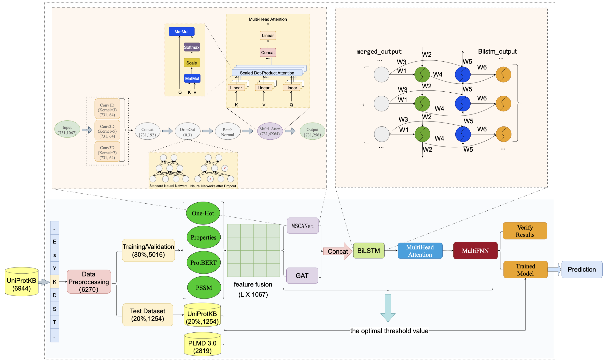
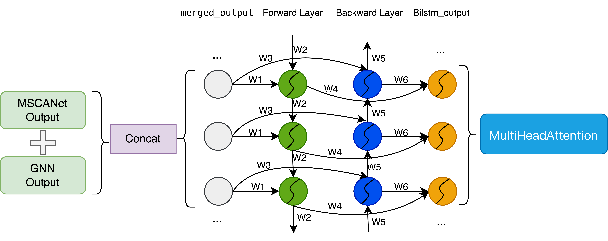

# ProMethylNet
ProMethylNet is a deep learning framework developed to improve the accuracy and practicality of protein methylation site prediction. Protein methylation, as a key post-translational modification (PTM), potentially plays a role in gene regulation, protein function, and signal transduction. Accurately identifying methylation sites may contribute to a better understanding of protein mechanisms and their involvement in disease pathways.

# Introduction to the experimental procedure
In this study, we designed an experimental framework for predicting protein methylation sites using data from UniProtKB and PLMD 3.0. Initially, protein sequences and their methylation annotations were extracted from FASTA and TSV files. To reduce redundancy and mitigate sequence homology bias, we applied the CD-HIT tool with a similarity threshold of 40% to cluster and filter the dataset. In addition, to ensure independence between the training and test sets, CD-HIT-2D was used to remove any test sequences showing more than 40% similarity to sequences in the training set. The retained sequences were further cleaned by replacing invalid characters and filtering by length.
For each valid protein sequence, we extracted multiple types of features, including semantic embeddings from a pre-trained ProtBERT model, evolutionary profiles using PSI-BLAST (PSSM), One-Hot encodings, and physicochemical property vectors of amino acids. These features were normalized, aligned in dimension, fused, and saved in HDF5 format for modeling.
The dataset was split into an 80% training/validation set and a 20% independent test set. We used 5-fold cross-validation during training to assess robustness. An adjacency matrix was constructed to assist in modeling residue relationships via a graph neural network. The model integrates a multi-scale convolutional attention network (MSCANet), a graph attention network (GAT), a bidirectional LSTM, and a self-attention module, followed by a fully connected layer for binary classification. The model was trained with a weighted binary cross-entropy loss, and early stopping and learning rate decay were applied to mitigate overfitting.
Throughout evaluation, we recorded key metrics including accuracy, precision, recall, F1-score, AUC, and MCC across the validation folds, and optimized the classification threshold on the validation set. A series of ablation studies were conducted to assess the contribution of each module and feature type. Finally, the model was retrained on the entire training and validation set and evaluated on the test set. ROC curves, PR curves, and confusion matrices were plotted to demonstrate the model’s predictive performance and robustness. We hope this workflow may provide useful insights for future work in PTM site prediction.

# Model
## Model Architecture

ProMethylNet integrates multiple sophisticated components to capture complex sequence-structure-function relationships:

1. **Multi-Scale Convolution-Attention Network (MSCANet):**  
   - Utilizes convolutional layers with kernel sizes of 3, 5, and 7 to extract short-, medium-, and long-range sequence dependencies.
   - Incorporates multi-head self-attention mechanisms to capture global contextual features.
   - Enhances feature diversity and hierarchical representation by combining convolutional and attention-based feature extraction.

2. **Graph Neural Network (GNN):**  
   - Employs Graph Attention Networks (GAT) to model long-range sequence correlations.
   - Constructs adjacency matrices to represent local dependencies, enabling the model to interpret interactions between non-adjacent residues.
   - Utilizes multi-head attention for improved feature aggregation and interaction modeling.

3. **Bidirectional Long Short-Term Memory (BiLSTM):**  
   - Processes sequences in both forward and backward directions, effectively capturing temporal dependencies.
   - Enhances the model's ability to understand context and long-range interactions within protein sequences.

4. **Multi-Modal Feature Integration:**  
   - **One-Hot Encoding:** Represents amino acid sequences for basic sequence features.
   - **Physicochemical Properties:** Captures molecular characteristics such as hydrophobicity and molecular weight.
   - **Position-Specific Scoring Matrices (PSSM):** Models evolutionary conservation and mutation sensitivity.
   - **ProtBERT Embeddings:** Derived from a pre-trained protein language model, capturing semantic and contextual sequence information.

5. **Classifier:**  
   - A multi-layer feedforward neural network serves as the final classifier.
   - Optimized using weighted binary cross-entropy loss to handle class imbalances.
   - Employs early stopping mechanisms to prevent overfitting.

## Multi-Scale Convolution-Attention Network Architecture

## Graph Neural Network Architecture

## BiLSTM Architecture

# Evaluation Metrics (on an independent test set)
ProMethylNet demonstrates state-of-the-art performance across various metrics:
- **Accuracy:** 99.75%
- **Precision:** 92.48%
- **Recall:** 90.36%
- **F1 Score:** 91.41%
- **Matthews Correlation Coefficient (MCC):** 91.29%
- **Area Under the Curve (AUC):** 99.36%

## Performance Results of Ablation Experiments
| Experiment | Accuracy (%) | Recall (%) | Precision (%) | F1 (%) | AUC (%) | MCC (%) |
|------------|------------|------------|------------|------------|------------|------------|
| **Baseline** | 99.752 | 90.361 | 92.480 | 91.408 | 99.359 | 91.289 |
| **No MSCANet** | 99.396 | 76.633 | 80.917 | 78.717 | 99.322 | 78.441 |
| **No GAT** | 99.692 | 91.600 | 87.815 | 89.668 | 99.315 | 89.532 |
| **No Attention** | 99.726 | 86.187 | 94.546 | 90.173 | 99.518 | 90.134 |
| **No BiLSTM** | 83.142 | 96.810 | 7.744 | 14.342 | 98.223 | 24.760 |
| **No MSCANet + No Attention** | 99.364 | 72.747 | 81.626 | 76.931 | 99.217 | 76.741 |
| **No MSCANet + No GAT** | 99.740 | 26.947 | 4.386 | 7.544 | 66.320 | 7.663 |
| **No MSCANet + No GAT + ProtBERT_PSSM** | 99.740 | 90.989 | 91.159 | 91.074 | 99.523 | 90.942 |
| **No Attention + No BiLSTM + OneHot** | 98.689 | 53.080 | 55.245 | 54.141 | 97.681 | 53.487 |
| **Features_OneHot_Properties** | 98.805 | 63.771 | 58.236 | 60.878 | 98.373 | 60.337 |
| **Features_ProtBERT_PSSM** | 99.818 | 91.193 | 96.153 | 93.607 | 98.916 | 93.549 |

## Observations
- **Baseline achieves the highest F1 score (91.408%)**, maintaining a good balance between Precision and Recall.
- **Removing BiLSTM drastically reduces F1-score (14.342%)**, indicating its critical role in long-sequence modeling.
- **No MSCANet + No GAT significantly drops AUC (66.320%)**, showing the importance of feature extraction and graph modeling.
- **ProtBERT_PSSM enhances classification performance (F1: 93.607%)**, demonstrating the benefits of deep feature representation.

# Performance Degradation & t-Test Results
## Experiment Comparison
| Experiment | F1 Reduction | p-value | AUC Reduction | p-value | MCC Reduction | p-value | Precision Reduction | p-value | Recall Reduction | p-value | Accuracy Reduction | p-value |
|------------|------------|------------|------------|------------|------------|------------|------------|------------|------------|------------|------------|------------|
| **no_MSCANet** | 0.1662 | 2.5721e-06 | 0.0027 | 2.6466e-03 | 0.1636 | 7.7692e-07 | 0.0861 | 3.2045e-03 | 0.2284 | 1.5632e-04 | 0.0039 | 4.2393e-06 |
| **no_GAT** | 0.0435 | 2.3891e-01 | -0.0004 | 6.9305e-01 | 0.0438 | 2.4180e-01 | 0.0247 | 4.7999e-01 | 0.0611 | 1.3967e-01 | 0.0011 | 2.6866e-01 |
| **no_Attention** | 0.0077 | 7.1493e-02 | -0.0007 | 5.0926e-01 | 0.0074 | 8.9086e-02 | -0.0112 | 3.2827e-01 | 0.0252 | 7.4310e-03 | 0.0001 | 2.5049e-01 |
| **no_BiLSTM** | 0.7565 | 5.4568e-04 | 0.1450 | 7.4424e-02 | 0.7119 | 2.0317e-03 | 0.5021 | 9.8665e-02 | 0.7989 | 5.1118e-05 | 0.0097 | 6.8347e-05 |
| **no_MSCANet_no_GAT** | 0.8774 | 9.1780e-09 | 0.4474 | 1.3736e-03 | 0.8737 | 1.8861e-08 | 0.7836 | 1.2532e-03 | 0.8717 | 5.7597e-08 | 0.0107 | 1.7090e-06 |
| **no_MSCANet_no_Attention** | 0.1534 | 2.0511e-05 | 0.0039 | 2.4728e-03 | 0.1469 | 2.0260e-05 | 0.0342 | 8.0569e-03 | 0.2405 | 7.8599e-06 | 0.0034 | 3.2917e-05 |
| **features_ProtBERT_PSSM** | -0.0228 | 2.0606e-04 | 0.0014 | 4.1379e-01 | -0.0231 | 2.1022e-04 | -0.0287 | 1.5606e-02 | -0.0169 | 7.5547e-02 | -0.0007 | 4.6349e-04 |
| **features_OneHot_Properties** | 0.3468 | 3.1477e-05 | 0.0152 | 1.1027e-03 | 0.3269 | 2.4352e-05 | 0.1439 | 1.1642e-03 | 0.4568 | 2.9190e-05 | 0.0069 | 2.8820e-05 |
| **no_MSCANet_no_GAT_features_ProtBERT_PSSM** | 0.0168 | 3.4866e-02 | 0.0001 | 8.7641e-01 | 0.0165 | 3.7371e-02 | -0.0072 | 2.1836e-01 | 0.0390 | 4.0711e-03 | 0.0004 | 6.6479e-02 |
| **no_Attention_no_BiLSTM_features_OneHot_Properties** | 0.4671 | 2.8015e-05 | 0.0401 | 2.0737e-02 | 0.3989 | 2.7932e-05 | 0.0287 | 1.0294e-01 | 0.6010 | 8.8345e-06 | 0.0075 | 2.7308e-05 |

## Summary
- The **no_BiLSTM** and **no_MSCANet_no_GAT** experiments show the most significant performance drop.
- **features_ProtBERT_PSSM** slightly improves performance (`F1: -0.0228`), indicating its effectiveness.
- The **t-test p-values** highlight statistically significant performance degradation for key experiments.

# Applications
ProMethylNet is a versatile tool applicable in various biological research domains:
- **Protein Function Analysis**
- **Disease Mechanism Research**
- **Drug Discovery and Precision Medicine**

# Conclusion
ProMethylNet demonstrates promising progress in the task of protein methylation site prediction. By integrating multi-modal features with layered neural network architectures, the model shows improved accuracy and generalizability to some extent. While there remains room for further refinement, its potential applications in biological and medical research are worth continued attention and investigation.

# Requirement
## Dataset link
https://ftp.uniprot.org/pub/databases/uniprot/knowledgebase/complete/uniprot_sprot.fasta.gz
https://www.uniprot.org/uniprotkb?query=methylation&facets=reviewed%3Atrue
## Hardware and Software Parameters
| **Component**       | **Specification**                         |
|--------------------|-------------------------------------|
| **CPU**           | Intel(R) Core(TM) i9-14900K 3.20 GHz |
| **GPU**           | NVIDIA GeForce RTX 4090 24GB        |
| **Memory**        | 64GB                                 |
| **Disk**          | 1TB SSD                              |
| **Operating System** | Windows 10 Enterprise LTSC           |
| **CUDA**          | 11.2.2                               |
| **cuDNN**         | 8.2.0                                |
| **IDE**           | Pycharm 2024.3.1.1                  |
| **Python**        | 3.8.20                               |

### Python Libraries
| **Library**        | **Version**   |
|--------------------|--------------|
| **TensorFlow**    | 2.10.0        |
| **NumPy**         | 1.24.3        |
| **Bio**           | 1.6.2         |
| **Pandas**        | 2.0.3         |
| **Torch**         | 2.4.1         |
| **Scikit-learn**  | 1.3.2         |
| **SciPy**         | 1.10.1        |
| **Matplotlib**    | 3.7.3         |

